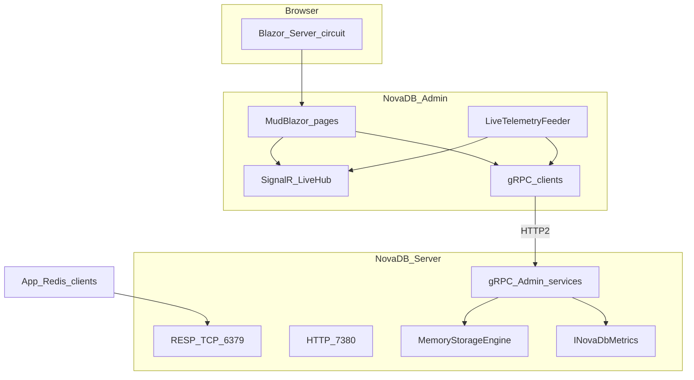

# NovaDB Admin — Architecture

Phase-1 ops platform: Blazor Server UI + gRPC control plane on NovaDB.Server + Aspire orchestration.

## Principles

- **UI never speaks RESP.** All ops go through gRPC.
- **Live updates:** Admin hosts SignalR; a hosted feeder calls unary gRPC snapshots ~1s and pushes to browsers.
- **Auth:** Cookie auth with roles Admin / Operator / ReadOnly.
- **Telemetry:** ServiceDefaults export OTLP when Aspire injects `OTEL_EXPORTER_OTLP_ENDPOINT`.

## Projects

| Project | Role |
| --- | --- |
| `NovaDB.Contracts` | `.proto` + generated gRPC stubs |
| `NovaDB.ServiceDefaults` | OTEL + health helpers |
| `NovaDB.Server` | RESP + HTTP health/metrics + gRPC admin |
| `NovaDB.Admin` | Blazor Server + MudBlazor |
| `NovaDB.AppHost` | Aspire orchestration |
