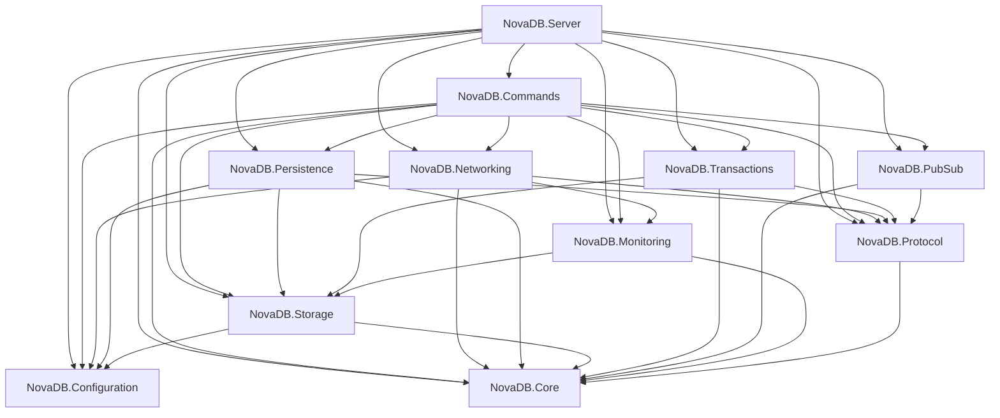

# 02 — Clean Architecture Review

## Dependency graph (actual ProjectReferences)

## Intended vs actual layering

| Rule | Status | Evidence |
|------|--------|----------|
| Core has no infra deps | **PASS** | `NovaDB.Core.csproj` has no ProjectReferences |
| Storage independent of Networking/Commands | **PASS** | Storage → Core, Configuration only |
| Persistence does not reference Commands | **PASS** | Replay via `IAofCommandReplayer`; wired in Commands (`DispatchingAofCommandReplayer`) |
| Protocol independent of Storage | **PASS** | Protocol → Core only |
| Commands as composition root of features | **WARNING** | Commands references *everything* including Persistence + Networking — thick application layer |
| No circular ProjectReferences | **PASS** | Graph is DAG |
| Networking not coupled to Storage | **PASS** | Networking never references Storage |
| Handlers not coupled to sockets | **PASS** | Handlers use `IClientConnection` / `CommandContext` |
| Persistence coupled to Protocol | **WARNING** | AOF stores RESP bytes (`AofWriter`, `AofDatasetEncoder` use `RespWriter`) — durable format = wire format |
| Static service locator | **WARNING** | `BgRewriteAofCommandHandler` / `DelCommandHandler` / `CommandCommandHandler` use `IServiceProvider.GetService` |
| DI lifetime mistakes | **WARNING** | `AddNovaDbNetworking` unused by Server; dual registration risk. Metrics `TryAdd`/`Replace` order-sensitive (`Program.cs` order saves it) |

## Layer ratings

| Layer | Rating | Rationale |
|-------|--------|-----------|
| **Core** | **PASS** | Clean models/exceptions; replication types are stubs only (`ReplicationAbstractions.cs`) — incomplete product surface, not a layering fail |
| **Storage** | **FAIL** | Process-wide `_dbGate` in `MemoryStorageEngine.cs` nullifies sharding for concurrency; `SetValue`/`HashValue` binary-unsafe — architecture of the engine itself is wrong for Redis replacement |
| **Protocol** | **FAIL** | `RespParser.TryParseBulk` allocates `new byte[length]` with **no max**; array `new RespValue[count]` before parse — DoS vector baked into protocol layer |
| **Networking** | **WARNING** | Pipelines + NoDelay are sound; `SocketPipeline` `pauseWriterThreshold: 65536` deadlocks large incomplete RESP with parser buffering; no KeepAlive; accept path awaits reject send |
| **Persistence** | **WARNING** | AOF fsync policies + CRC snapshots + generation fallback are real; exclusive rewrite/snapshot via `RunExclusiveAsync` stalls the world; AOF replay loads entire file (`AofReplayEngine`) |
| **Commands** | **WARNING** | Open registration of handlers is good; god-file handler groups; SCAN materializes full keyspace; AUTH reconnect bypass |
| **Monitoring** | **FAIL** | `NovaDbHealthCheck` ignores `DatabaseRecoveryGate`; scans storage; no readiness/liveness split; no tracing |

## Circular / leak findings (file-backed)

1. **Infrastructure in domain values:** `SetValue.cs` embeds UTF-8 string encoding assumptions — domain type is not binary Redis-compatible.
2. **Protocol as persistence format:** `Persistence/Aof/*` depends on `NovaDB.Protocol` — changing RESP encoding breaks on-disk durability.
3. **Composition inconsistency:** `Networking/ServiceCollectionExtensions.AddNovaDbNetworking` registers `TcpServerHostedService`, but `Server/Program.cs` constructs it manually with recovery gate — two ways to host TCP.

## Verdict

Dependency *direction* is mostly correct (DAG). Runtime architecture inside Storage/Protocol/Networking has production-blocking defects (global gate, unbounded parse, pipe pause). Clean architecture on paper ≠ production readiness.
