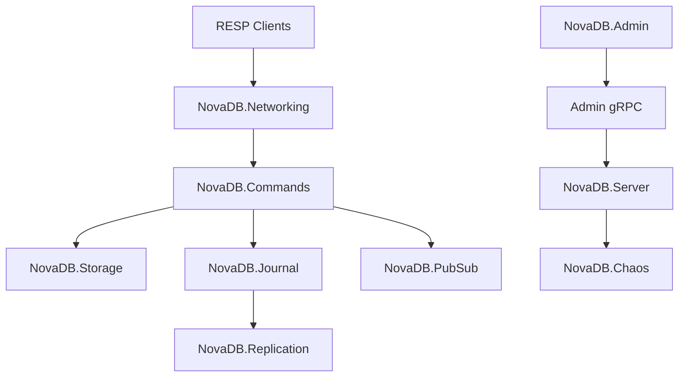

# 01 — Architecture

NovaDB is a single-node Redis-compatible in-memory cache on `.NET 10` with RESP2 TCP, AOF/snapshots, Admin gRPC, and production-maturity foundations (journal, replication stubs, chaos, soak).

## Host wiring order

1. Configuration / Protocol / Storage / Persistence  
2. `AddNovaDbJournal()`  
3. `AddNovaDbReplication()`  
4. `AddNovaDbChaos()`  
5. Commands + TCP accept loop  

## Compatibility

Empty `NovaDB:Password` still means open AUTH (backward compatible). `RequireAuthForWrites` is opt-in.
