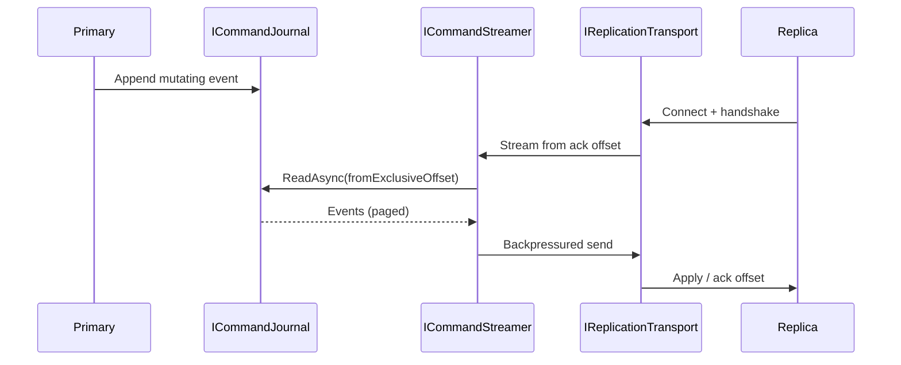

# 02 — Replication Foundation

Phase 3 delivers **interfaces and in-process primitives only**. There is **no** leader election and no automatic failover.

## Goals

- Stream mutations from the command journal to replicas
- Snapshot handshake for catch-up
- Flow control / backpressure
- Replica reconnect with last-ack offset
- Read-only replica mode on the data plane

## Components

| Type | Role |
| --- | --- |
| `ICommandStreamer` / `InMemoryCommandStreamer` | Journal stream + channel backpressure |
| `ReplicationOffsetTracker` | Primary offset vs replica ack |
| `IReplicaSession` / `ReplicaSession` | Reconnect token + last ack |
| `FlowControlWindow` | Credit / in-flight bytes |
| `IReplicationTransport` | `NullReplicationTransport` or `TcpReplicationTransport` stub |
| `IReplicationSnapshot` / `SnapshotHandshake` | Snapshot id + journal offset after snapshot |

## Data flow

## Configuration

| Option | Meaning |
| --- | --- |
| `ReadOnlyReplica` | Reject mutating RESP commands with `READONLY` |
| Journal offset | Equals replication offset (`EventId`) |

Register with `AddNovaDbReplication()` **after** `AddNovaDbJournal()`.

## Non-goals (explicit)

- Raft / Paxos / Sentinel-style election
- Automatic promotion
- Cross-datacenter conflict resolution
