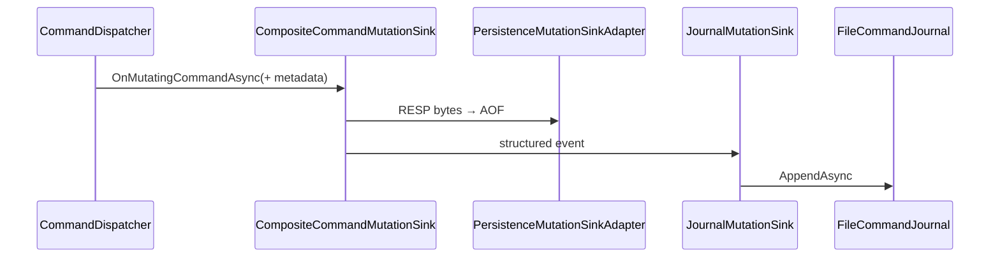

# 03 — Command Journal

The durable journal (`commands.ndbj`) records every mutating command as an immutable event. It is the foundation for replication streaming and time-travel debugging, and is **independent of AOF** (both can run together via a composite mutation sink).

## Event fields

| Field | Description |
| --- | --- |
| EventId | Monotonic append offset (replication offset) |
| Timestamp | UTC accept time |
| ClientId | Connection id |
| TransactionId | EXEC batch correlation (empty for single commands) |
| Command | Uppercase name (`SET`, `DEL`, …) |
| Arguments | Argument payloads as bytes |
| Key | Primary key bytes when present |
| Version | Key version at commit (0 if unknown) |
| Checksum | CRC32 of serialized payload |

## Requirements met

- Append-only file format (`NDBJ` magic + versioned header)
- Streaming reader (`IAsyncEnumerable`, page size)
- Replay support (`ReplayAsync`)
- CRC validation (corrupt tail truncated on open)
- Duplicate-write suppression via optional dedupe key
- ArrayPool-friendly framing where practical

## Configuration

| Option | Default | Meaning |
| --- | --- | --- |
| `JournalEnabled` | true | Open/append journal |
| `JournalFlushOnAppend` | false | fsync each append |

## Integration

Never load the entire journal into memory for Admin History — always stream with `fromExclusiveOffset` + `pageSize`.
