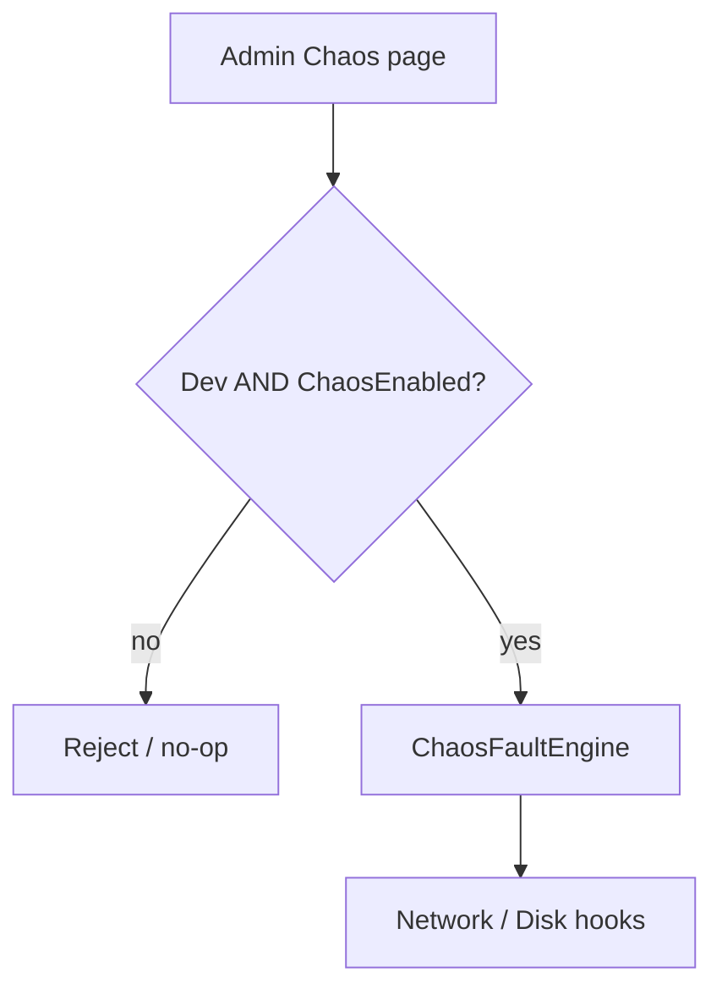

# 04 — Chaos Engineering

`NovaDB.Chaos` provides an injectable fault engine for Development drills.

## Supported faults

| Fault | Effect |
| --- | --- |
| NetworkLatency | Delay before network read/write hooks |
| PacketLoss | Probabilistic skip of write side-effects |
| DiskFull | Simulate disk-full on journal/AOF hooks |
| SlowDisk | Delay before disk write hooks |
| MemoryPressure | Allocate temporary LOH pressure |
| SocketDisconnect | Request connection close |
| AofCorruption | Mark AOF path unhealthy for drills |
| SnapshotInterruption | Abort snapshot mid-flight |
| ThreadPoolStarvation | Queue blocking work items |

## Safety gate

Faults **only** activate when **both** are true:

1. `NovaDB:ChaosEnabled=true`
2. Host environment is `Development`

Production and Staging always no-op, even if Admin calls the Chaos gRPC API (server rejects).

Use Admin → **Chaos** to trigger and clear faults. Clear all faults before demos.
