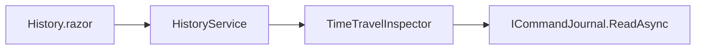

# 05 — Time Travel Debugging

Historical inspection is built on the command journal streaming API.

## Admin → History

- Search by key (UTF-8)
- Paginate by `last_event_id` cursor (never full-file load)
- View command, client, timestamp, transaction id
- Diff consecutive mutations for the same key (previous vs new argument preview)

## Engine

`TimeTravelInspector` / `ITimeTravelInspector` wraps `ICommandJournal.ReadAsync` with key/command filters and a lightweight diff helper.

## Operational notes

- Journal must be enabled (`JournalEnabled`)
- Large keys: previews are truncated for UI safety
- Replay timeline is event-order by `EventId`, not wall-clock skew across nodes
