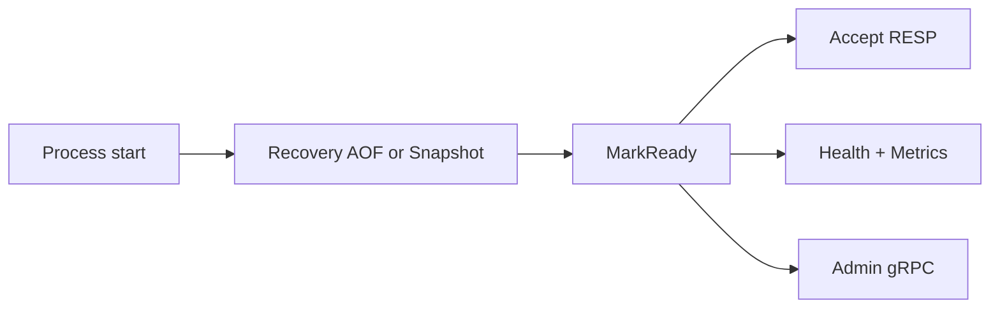

# 07 — Operations Runbook

Operational procedures for NovaDB in production.

## Startup

1. Ensure `NovaDB:DataDirectory` exists on durable storage.
2. Confirm `JournalEnabled=true` and AOF/snapshot settings match the durability SLO.
3. Start via Aspire (`aspire/NovaDB.AppHost`) or `dotnet run --project src/NovaDB.Server`.
4. Wait until `/health` reports ready (recovery gate open).
5. Verify Admin UI login and Metrics page show live clients/memory.

## Common incidents

| Symptom | Check | Action |
| --- | --- | --- |
| Clients cannot connect | Recovery gate, bind address, max connections, rate limit | Inspect logs; raise `MaxConnections` / rate limit if intentional |
| Rising memory | Memory Diagnostics page, eviction policy | Set `MemoryLimitBytes` + policy; flush unused keys |
| AOF lag / slow writes | AOF flush policy, disk latency, Chaos slow-disk | Switch `everysec` if `always` is too costly; fix disk |
| Journal growth | Journal size gauge / data dir | Schedule snapshot + AOF rewrite; archive old journals offline |
| Replica READONLY errors | `ReadOnlyReplica` | Expected on replicas; send writes to primary |

## Controlled restart

1. Drain traffic / stop accept (stop process gracefully).
2. Confirm AOF/journal flush completed (`StopAsync` on hosted services).
3. Restart; validate recovery replay duration and key count.

## Chaos (Development only)

Never enable `ChaosEnabled` in Production. In Development, use Admin → Chaos to inject latency, disconnects, or disk pressure, then clear faults before demos.

## Escalation data to capture

- `/health` JSON
- Prometheus scrape of `novadb.*`
- Admin Diagnostics GC snapshot
- Tail of server logs around failure
- Journal offset (`ICommandJournal.CurrentOffset`) and AOF file size
