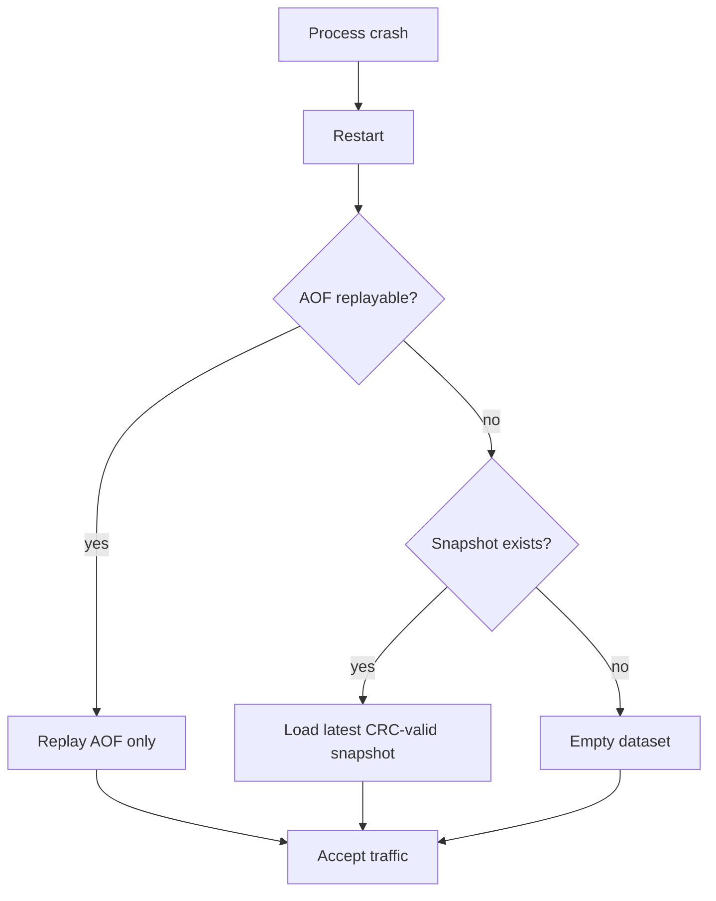

# 09 — Disaster Recovery

Recovery objectives assume NovaDB is operated as a **rebuildable cache** unless AOF/snapshots/journal are explicitly relied upon.

## Recovery modes

**Rule:** Never apply both snapshot and AOF in one recovery to avoid double-applying append-style mutations.

## Journal role

The command journal (`commands.ndbj`) is the foundation for:

- Time-travel debugging (History page)
- Future replica catch-up (replication offset = journal event id)

CRC failure truncates the corrupt tail on open; prior valid events remain.

## Backup recommendations

| Artifact | Frequency | Notes |
| --- | --- | --- |
| Snapshot files | Periodic (`SnapshotInterval`) | Keep `SnapshotGenerationCount` generations |
| AOF | Continuous when enabled | Copy only after clean shutdown or with filesystem freeze |
| Journal | Continuous when enabled | Optional offline archive for forensics |

## Failover (current topology)

NovaDB remains **single-node**. There is **no** automatic leader election.

Read-only replica mode (`ReadOnlyReplica=true`) rejects mutating commands so a standby can be promoted **manually**:

1. Stop accepting writes on the failed primary.
2. Ensure standby journal/AOF is caught up (ops-owned).
3. Set `ReadOnlyReplica=false` on the chosen primary and restart.
4. Point clients at the new primary.

## Corruption drills

1. Truncate AOF mid-record in a lab → expect recovery to stop cleanly or fail gate.
2. Corrupt journal CRC → expect truncate-to-last-valid on start.
3. Interrupt snapshot write → previous generation should remain loadable.

## RPO / RTO guidance

| Durability setting | Approx RPO | Notes |
| --- | --- | --- |
| AOF `always` | Near-zero | Highest latency |
| AOF `everysec` | ≤ ~1s | Default balance |
| AOF `no` / disabled | Last snapshot only | Demo/ephemeral |
| Journal flush on append | Near-zero journal RPO | Independent of AOF |
