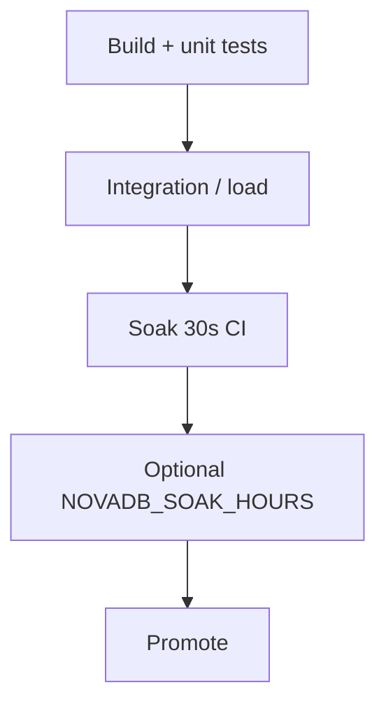

# 10 — Production Checklist

- [ ] `JournalEnabled` and data directory durable/backed up  
- [ ] AUTH password set for non-loopback binds (or TLS)  
- [ ] `ChaosEnabled=false` outside Development  
- [ ] Prometheus `/metrics` scraped; Admin Observability pages reviewed  
- [ ] Soak suite run (`Category=Soak`) before release  
- [ ] Benchmarks captured into `benchmark-results.md`  
- [ ] Replication foundation settings documented if deploying read-only replicas  

