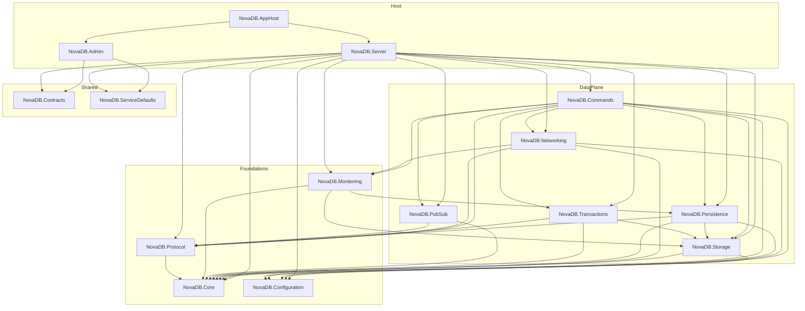
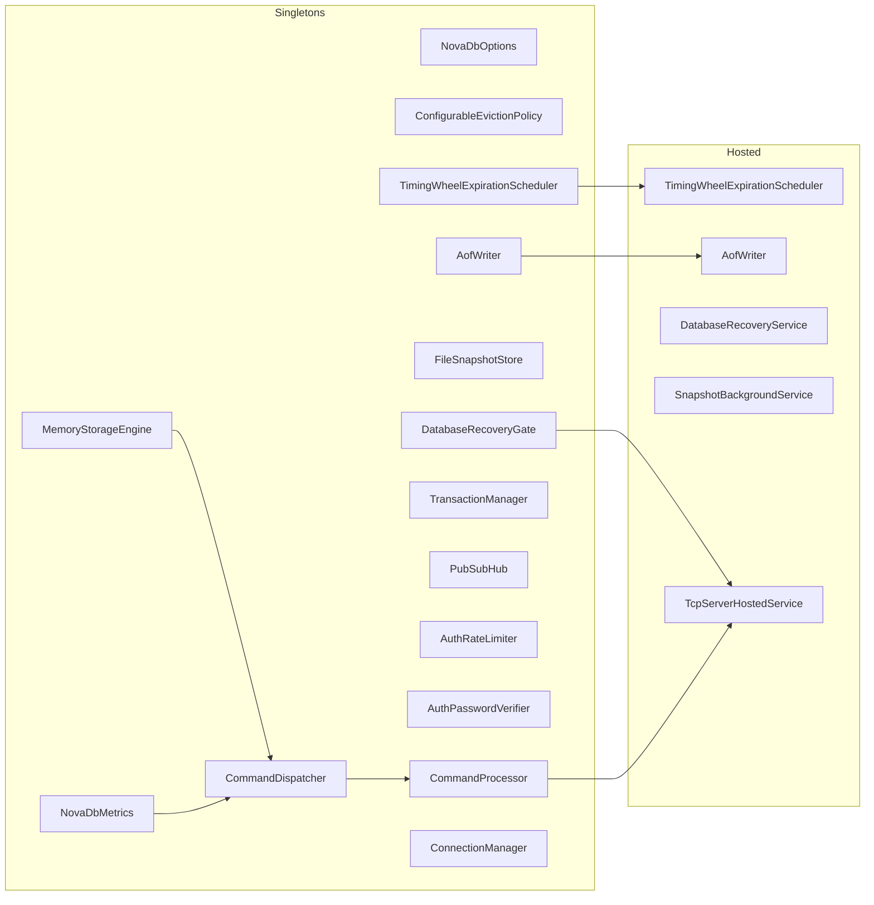
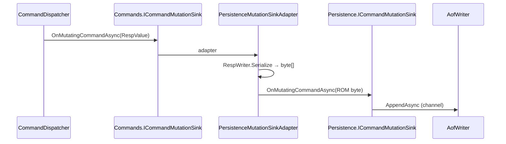
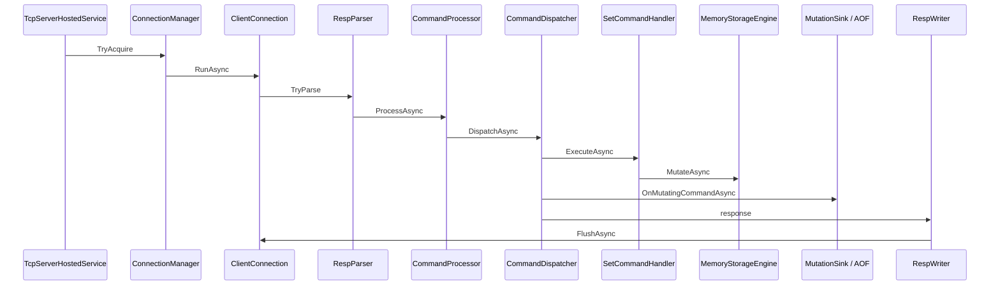
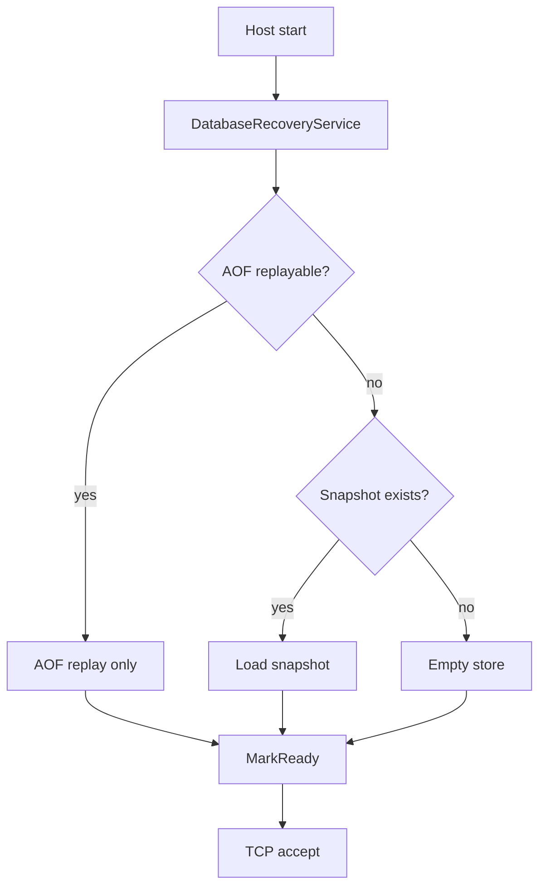

# NovaDB Architecture Audit (Phase 1)

**Date:** 2026-09-17  
**Scope:** Full solution read-only audit prior to production-maturity upgrades  
**Product mode:** Single-node Redis-compatible in-memory cache (`.NET 10`)  
**Constraint:** Existing functionality must remain intact; changes are incremental and backward compatible

---

## 1. Executive summary

NovaDB is feature-complete for a single-process Redis-compatible cache: RESP2 TCP, sharded storage, TTL, transactions, pub/sub, AOF, snapshots, Aspire orchestration, Blazor Admin, OpenTelemetry, and health checks.

Gaps for enterprise production maturity (addressed in subsequent phases):

| Gap | Impact | Phase |
| --- | --- | --- |
| No durable command journal independent of AOF | Cannot stream mutations for replication / time-travel | 2 |
| Replication not implemented | No HA / read replicas | 3 |
| No historical key mutation inspection | Ops debugging limited to live state | 4 |
| No chaos injection | Failure modes untested under controlled faults | 5 |
| Residual hot-path allocations | Latency / GC pressure under load | 6–7 |
| Partial security surface (ACL stub, no roles on RESP) | Auth exists; authorization is coarse | 8 |
| Load tests exist; soak/report automation incomplete | Soak evidence not CTO-grade | 9 |
| Metrics cover core path; missing journal/replication/GC pause | Ops blind spots | 10 |

---

## 2. Solution layout

```text
NovaDB/
├── NovaDB.slnx
├── Directory.Build.props          # net10.0, nullable, TreatWarningsAsErrors, XML docs
├── src/                           # 14 production projects
├── tests/                         # Unit, Protocol, Integration, Load, Admin
├── aspire/NovaDB.AppHost          # DistributedApplication (Server + Admin)
├── benchmarks/NovaDB.Benchmarks
└── docs/                          # Architecture, Admin/, Audit/, Production/
```

All projects target **net10.0**.

---

## 3. Dependency graph

### 3.1 Project references (Mermaid)



### 3.2 Layering rules (observed)

| Layer | May depend on | Must not depend on |
| --- | --- | --- |
| Core | — | Everything else |
| Protocol / Configuration | Core | Storage, Commands, Networking |
| Storage | Core, Configuration | Commands, Networking |
| Persistence | Core, Storage, Protocol, Configuration | Commands handlers |
| Commands | Nearly all data-plane projects | Server, Admin |
| Server | Everything (composition root) | Admin |
| Admin | Contracts, ServiceDefaults | Server internals |

**Note:** Commands currently references Persistence for the mutation sink adapter. A future journal/replication fan-out should remain behind `ICommandMutationSink` so Commands stays transport-agnostic.

---

## 4. Project responsibilities

| Project | Responsibility |
| --- | --- |
| **NovaDB.Core** | Domain models (`RedisKey`, `DatabaseEntry`), `ClientSession`, exceptions, `IDatabaseReadiness` |
| **NovaDB.Protocol** | RESP2 parse/write over `ReadOnlySequence` / `PipeWriter`; `RespParseLimits` |
| **NovaDB.Configuration** | `NovaDbOptions` + ValidateOnStart (ports, shards, public-bind security) |
| **NovaDB.Storage** | Sharded `MemoryStorageEngine`, timing-wheel expiration, eviction policies, value types |
| **NovaDB.Persistence** | AOF writer/replay, CRC snapshots, recovery gate, periodic snapshot + rewrite |
| **NovaDB.Networking** | TCP accept, Pipelines duplex, TLS option, connection limits, idle timeout |
| **NovaDB.Commands** | Handler registry, dispatcher, AUTH/ACL gates, MULTI queue, AOF mutation recording |
| **NovaDB.Transactions** | `WATCH` / `MULTI` / `EXEC` / `DISCARD` |
| **NovaDB.PubSub** | In-process channel hub with async fan-out |
| **NovaDB.Monitoring** | OTel meter `NovaDB`, Prometheus, health check, AOF/storage metric adapters |
| **NovaDB.Contracts** | `admin.proto` → Admin↔Server gRPC |
| **NovaDB.ServiceDefaults** | Aspire OTel/logging/health defaults |
| **NovaDB.Server** | Composition root: Kestrel HTTP+gRPC, DI, recovery-gated TCP |
| **NovaDB.Admin** | MudBlazor ops UI, cookie auth, SignalR live feeder |
| **NovaDB.AppHost** | Aspire orchestration of Server + Admin |

---

## 5. DI graph

### 5.1 Composition order (`NovaDB.Server` Program.cs)

```text
AddServiceDefaults
→ AddNovaDbConfiguration
→ AddNovaDbProtocol          (currently no-op)
→ AddNovaDbStorage
→ AddNovaDbPersistence
→ AddNovaDbTransactions
→ AddNovaDbPubSub
→ AddNovaDbMonitoring
→ AddNovaDbCommands
→ AddNovaDbCommandReplay
→ ConnectionManager + TlsCertificateProvider (singleton)
→ TcpServerHostedService (recovery-gated)
→ gRPC + HealthChecks
```

### 5.2 Mermaid DI / hosted service view



### 5.3 Lifetimes

- **RESP data plane:** all Singleton (no scoped/transient on hot path).
- **Admin:** `ThemeState` Scoped; `LiveTelemetryFeeder` Hosted; audit log Singleton.
- **`AddNovaDbNetworking()`** exists but is **unused** by Server — TCP is wired manually for recovery gating.

### 5.4 Dual mutation sink boundary



This serialize-on-every-mutation path is a primary allocation target for Phase 2/6.

---

## 6. Hosted services and background workers

| Service | Type | Role |
| --- | --- | --- |
| `TimingWheelExpirationScheduler` | `IHostedService` | 50ms tick; active expire |
| `AofWriter` | `IHostedService` | Channel drain + optional everysec fsync |
| `DatabaseRecoveryService` | `IHostedService` | Snapshot **or** AOF replay; mark ready/failed |
| `SnapshotBackgroundService` | `BackgroundService` | Periodic snapshot + AOF rewrite |
| `TcpServerHostedService` | `BackgroundService` | Accept loop after recovery |
| `LiveTelemetryFeeder` | `BackgroundService` (Admin) | Poll gRPC → SignalR |

**Not separate workers:**

- Eviction: synchronous on write when over `MemoryLimitBytes`
- Lazy expire-on-read
- AOF rewrite via `TryScheduleBackgroundRewrite` / `Task.Run`

---

## 7. Hot path analysis

### 7.1 SET command path



### 7.2 Latency contributors (ordered)

1. Shard lock + dictionary mutate (+ possible eviction sample)
2. AOF path: RESP serialize + channel enqueue (+ fsync wait under `always`)
3. RESP parse bulk copies into owned `byte[]`
4. Command name `AsUtf8String().ToUpperInvariant()` per request
5. Metrics histogram record

### 7.3 Correctness gates on path

- AUTH required when password set
- Pub/sub command allow-list
- MULTI queues non-transaction commands as `QUEUED`
- Recovery gate blocks accept until replay completes

---

## 8. Allocation map

### 8.1 Per-command (hot)

| Site | Allocation | Notes |
| --- | --- | --- |
| `CommandContext.CommandName` | string + uppercase | Every command |
| `RespParser` bulk values | `byte[]` copy | Pipeline lifetime safety |
| `PersistenceMutationSinkAdapter` | serialized `byte[]` | Every mutating command |
| Option parsing (`SET NX XX…`) | UTF-8 strings | Mutating path |

### 8.2 Cold / occasional

| Site | Allocation |
| --- | --- |
| `KEYS` / `SCAN` / `SMEMBERS` / `ZRANGE` | Arrays / LINQ materialization |
| `COMMAND` / `HELLO` | Map/array construction |
| ConnectionManager snapshots | `ToArray` |

### 8.3 Clean areas (no Split/Substring in hot projects)

Commands / Protocol / Networking / Storage: **no** `.Split(` or `.Substring(` on audited paths.

### 8.4 Recommended Phase 6 targets

1. ASCII command-name compare without string alloc (span / ordinal ignore-case on bytes)
2. Journal/AOF write without intermediate full serialize where frames already exist
3. Prefer `ValueTask` end-to-end (largely already done)
4. Avoid LINQ on command execution paths (mostly clean for SET/GET)

---

## 9. Persistence and recovery



**Policy:** AOF **or** snapshot — never both — to avoid double-application of append-style commands.

---

## 10. Security posture (as of audit)

| Control | Status |
| --- | --- |
| AUTH + timing-safe compare | Implemented |
| Per-connection + IP lockout | Implemented |
| RESP size limits | Implemented |
| Max connections | Implemented |
| Optional TLS (PFX) | Implemented |
| Public bind requires Password/TLS | ValidateOnStart |
| Redis ACL | Probe-only (WHOAMI/LIST/…) |
| RESP roles (Admin/Operator/ReadOnly) | Not on data plane |
| Connection rate limiting | Not yet |
| Audit trail for destructive ops | Admin-side partial |

---

## 11. Observability posture (as of audit)

**Meter:** `NovaDB`

| Instrument | Name |
| --- | --- |
| Histogram | `novadb.command.latency` |
| UpDownCounter | `novadb.clients.connected` |
| Counters | cache hits/misses, evictions, expired |
| Gauges | memory bytes, AOF queue depth, AOF rewrite in progress |

**Missing for production++:** journal size, replication lag, AOF flush latency, GC pause histogram, socket backlog, ThreadPool queue length.

---

## 12. Admin surface (as of audit)

| Route | Page |
| --- | --- |
| `/` | Dashboard |
| `/keys` | Keys |
| `/clients` | Clients |
| `/memory` | Memory |
| `/persistence` | Persistence |
| `/pubsub` | PubSub |
| `/metrics` | Metrics |
| `/logs` | Logs |
| `/health` | Health |
| `/settings` | Settings |

**Planned additions:** History, Diagnostics, Replication, Chaos, Performance.

---

## 13. Test and benchmark landscape

| Project | Focus |
| --- | --- |
| UnitTests | Commands, storage, AOF recovery, ACL, eviction |
| ProtocolTests | RESP parsing |
| IntegrationTests | TCP, gRPC Admin, StackExchange.Redis, soak |
| LoadTests | Concurrent clients, Always-AOF EXEC, gate-free throughput |
| AdminTests | Auth |
| NovaDB.Benchmarks | BenchmarkDotNet |

Coverage target for production maturity: **95%** (property, fuzz, chaos, crash recovery, replication).

---

## 14. Architectural recommendations (no code changes yet)

1. **Introduce `NovaDB.Journal`** as append-only immutable event log; fan-out from dispatcher via composite `ICommandMutationSink` — preserve AOF behavior.
2. **Introduce `NovaDB.Replication`** behind interfaces only (no election); journal offset = replication offset.
3. **Time-travel** reads journal with streaming pagination — never full load.
4. **Chaos** as Development-only injectable faults (`NovaDB.Chaos`).
5. **Do not** break RESP public API, existing options defaults, or Admin cookie auth contract.
6. Keep `TreatWarningsAsErrors` / nullable / CancellationToken discipline.

---

## 15. Success criteria mapping

| Criterion | Current | Path |
| --- | --- | --- |
| Millions of keys | Sharded store supports; memory-bound | Eviction + soak |
| Thousands of clients | `MaxConnections` default 10k | Rate limit + connection churn tests |
| Graceful crash recovery | AOF/snapshot gate | Journal CRC + crash tests |
| Historical debugging | Absent | Phase 4 |
| Replication-ready streaming | Absent | Phases 2–3 |
| Live operational diagnostics | Partial Admin | Phases 7, 10 |

---

*End of Phase 1 audit. No production code was modified.*
